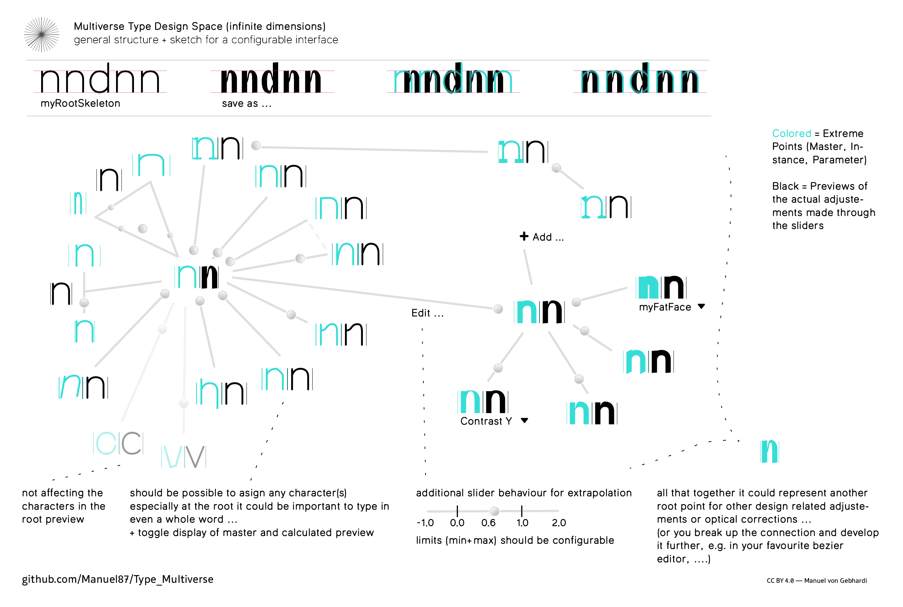
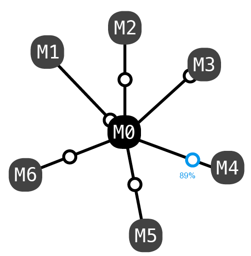
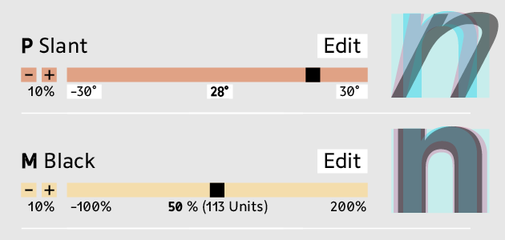
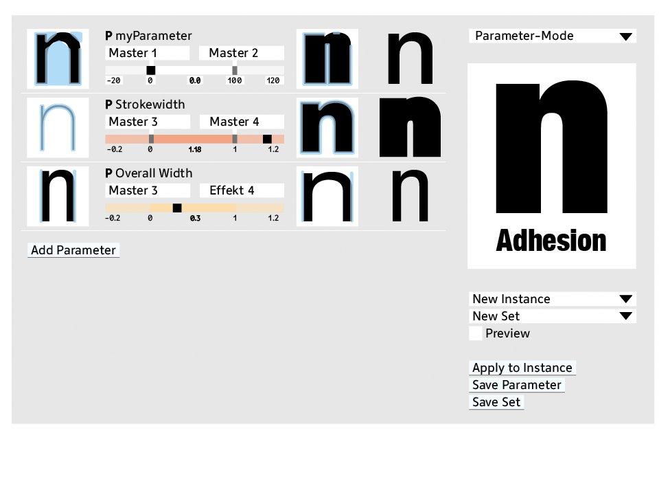
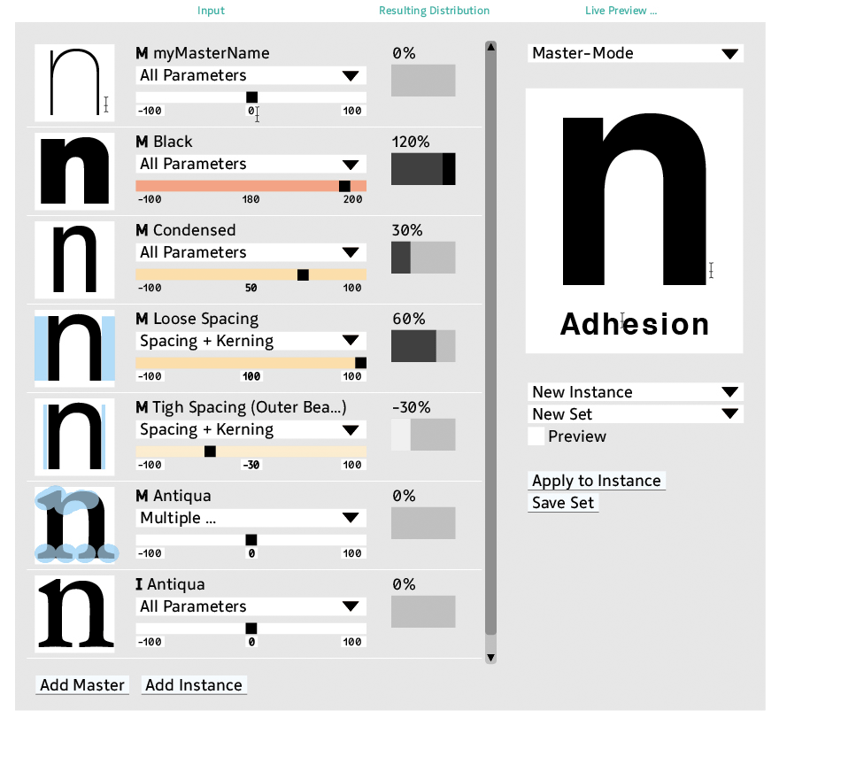

Multiverse Type Design Space (parametrical) Interpolation Interface 
===========
This is a proposal extending the well known Noordzij Cube (with three dimensions) to an infinite number of dimensions, while still being able to handle it. :)

This visualisation shows an example with about 16 dimensions/axes 

Each Point represents either a …
---
• Master (editable/already edited Instance, any other/extern compatible design …)  
• Instance (a possiblity represented by any point in the design-space multiverse ;) 
• Parameter/Effect/Filter/Algorithm (a designed and engineered formal modifcation, using data from the Masters/Instances + other (user) inputs. (e.g. Path-Offset,Slant, Cursivy, box-shadow, Tension, RMX-Tools, …)

The main Root-Point represents a user defined default setup, which can be either a Master or an Instance. All other Points in the system are reffering to the Root-Point. This not only makes it much easier to grasp, suddenly the actual calculations  e.g. for an interpolation are getting much easier. (ToDo: adding an calculation example)

The actual technique is irrelevant! It could be …
----
• Standard linear vector calculation (Interpolation) 
(restrictions are made quite clear here: http://partners.adobe.com/public/developer/en/font/5091.Design_MM_Fonts.pdf (p.12-17)  
• Elaborated vector calculation, only eliminating the interpolation restrictions (not seen yet … ?) 
• Kalliculator calculations  
• Metafont calculations (Metapolation) 
• Prototypo calculations 
• Font Chamelion calculations :) 
• … 
• A combination of all :D (that would be another project) 
• Or just drawing it, using beziers or a penci!, etc.  

No matter what input/output format (open/proprietary): Postscript Type 1, MM, …, OTF, …, UFO3, Glyphs, VFB, Metafont, Prototypo,Knoths Typy, …) — sure, the more it offers the better…

Math for Interpolation
---
The Basic Math of an Interpolation looks like that:

I = M1·a + M2·b + M3·c .. n·M[N]  
and the sum of all the factors (a, b, c .. n) equals 100%.

The above description is from: https://github.com/metapolator/metapolator/wiki/metapolation#the-math

-----
And here an example to extend that a bit:

Actually the math for an ›root interpolation‹ is not any different from an basic interpolation between only two masters:  
I = M1·0% + M2·100% (basic) = M1·100%-100% + M2·100% = M1·a-b + M2·b (M1 = root)   

or three/more:   
I = M1·a-b-c-… + M2·b + M3·c + …  
if b and c is set to 100%, M2 and M3 will get applied in full extend
at least if you think of  M2 and M3 as changes made to M1. 

So you only add the changes rather than adding or averaging everything. 
And the 100% rule for the factors isn’t touched by that.

-------

A more basic visualisation: 

-----------
-----------
-----------

And some more sketches for another interface
----
Sliders 

This specific example is inspired by Tim Ahrens RMX Scaler: 
 

Less suitable interpolation technique 
----
This Example uses a more basic interpolation method/calculation (no Root-Method), wich makes it quite complicated if you have more than three masters: 
 
The script doing the calculation you find in this repository. (for Glyphs)
(even though simple ›parameters‹ as spacing, kerning, x-Interpolation, y-Interpolation wouldn’t be that hard… this is not implemented there) 

// TODO: upload another script with the ›root-method‹

# License

The content of this project is licensed under the <a rel="license" href="http://creativecommons.org/licenses/by/4.0/">CC BY 4.0</a> – So feel free to implement it anywhere!  Type Design Multiverse by <a xmlns:cc="http://creativecommons.org/ns#" href="https://github.com/Manuel87/Type_Multiverse" property="cc:attributionName" rel="cc:attributionURL">Manuel von Gebhardi</a> is licensed under a <a rel="license" href="http://creativecommons.org/licenses/by/4.0/">Creative Commons Attribution 4.0 International License</a>.
