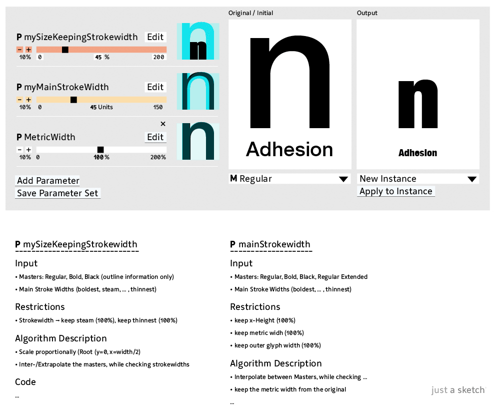

Multiverse Type Design Space (parametrical) Interpolation Interface 
===========
This is a proposal extending the well known Noordzij Cube (with three dimensions) to an infinite number of dimensions, while still being able to handle it. :)

This visualisation shows an example with about 16 dimensions/axes 

Each Point can represent either a: 
• Master (editable/already edited Instance, any other/extern compatible design …)  
• Instance (a possiblity represented by any point in the design-space multiverse ;) 
• Parameter/Effect/Filter/Algorithm (a designed and engineered formal modifcation, using data from the Masters/Instances + other (user) inputs. (e.g. Path-Offset,Slant, Cursivy, box-shadow, Tension, RMX-Tools, …)

The main Root-Point represents a user defined default setup, which can be either a Master or an Instance. All other Points in the system are reffering to the Root-Point. This not only makes it much easier to grasp, suddenly the actual calculations  e.g. for an interpolation are getting much easier. (ToDo: adding an calculation example)

The actual technique is irrelevant! It could be: 
• Standard linear vector calculation (Interpoaltion) 
(restrictions are made quite clear here: http://partners.adobe.com/public/developer/en/font/5091.Design_MM_Fonts.pdf (p.12-17)  
• Elaborated vector calculation (not seen yet ^^) 
• Kalliculator calculations  
• Metafont calculations (Metapolation) 
• Prototypo calculations 
• Font Chamelion calculations :) 
• … 
• A combination of all :D (that would be another project) 
• Or just drawing it, using beziers or a penci!, etc.  

No matter what input/output format (open/proprietary): Postscript Type 1, MM, …, OTF, …, UFO3, Glyphs, VFB, Metafont, Prototypo,Knoths Typy, …) 

-------

A more basic visualisation: 

Sliders 

-----------

And some more sketches for another interface (specific example is inspired by Tim Ahrens RMX Scaler): 
 

This Example uses a very basic interpolation method (no Root-Method) interpolation, wich makes it really complicated if you have more than two or three masters: 
 
If you leave the parameter thing aside the ›Master-Mode‹ is technically really simple to implement… the hardest thing is to code the interface for it ;) 
(even though simple ›parameters‹ as spacing, kerning, x-Interpolation, y-Interpolation would be quite easy to implement as well) 

# License

The content of this project is licensed under the <a rel="license" href="http://creativecommons.org/licenses/by/4.0/">CC BY 4.0</a> – So feel free to implement it anywhere!  Type Design Multiverse by <a xmlns:cc="http://creativecommons.org/ns#" href="https://github.com/Manuel87/Type_Multiverse" property="cc:attributionName" rel="cc:attributionURL">Manuel von Gebhardi</a> is licensed under a <a rel="license" href="http://creativecommons.org/licenses/by/4.0/">Creative Commons Attribution 4.0 International License</a>.
